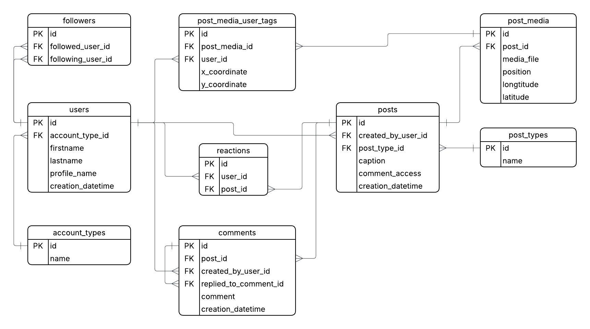

# Social Network Demo Schema

## 1. Business Scope

This Social Network Demo application models the core functionality of a simplified social media platform.

The application allows users to:

- Register and create accounts with different account types (e.g., personal, business).
- Follow and unfollow other users.
- Create posts with captions and different post types.
- Attach media files to posts.
- Tag users in post media with positional coordinates.
- React to posts.
- Comment on posts.
- Reply to existing comments (nested comments).
- Control comment access on posts (e.g., who can comment).

The system focuses on representing user relationships, content publishing, interaction (reactions and comments), and media management in a structured relational database schema.

---

## 2. Nouns Extracted from Business Description

From the domain description, the following core nouns (entities) were identified:

- User
- Account Type
- Follower
- Post
- Post Type
- Post Media
- Media Tag (Post Media User Tag)
- Reaction
- Comment
- Comment Access

These nouns were translated into database tables and relationships in the schema.

---

## 3. Database Schema

Below is the ER diagram representing the relational schema of the Social Network Demo application:

Entities included in the schema:

- users
- account_types
- followers
- posts
- post_types
- post_media
- post_media_user_tags
- reactions
- comments

The schema models:

- One-to-many relationships (User → Posts, Post → Comments, Post → Media)
- Many-to-many relationships (Users following Users)
- Self-referencing relationships (Comments replying to Comments)
- Foreign key constraints to enforce referential integrity

---

## 4. Conclusion

This schema represents a normalized relational model of a simplified social networking system.

It captures:

- User identity and classification
- Social graph (followers)
- Content publishing (posts and media)
- Interaction mechanisms (reactions and comments)
- Access control at post level (comment access)
- Extensibility through lookup tables (account_types, post_types)

The design aims to balance simplicity and extensibility while preserving clear domain boundaries and relational integrity.
